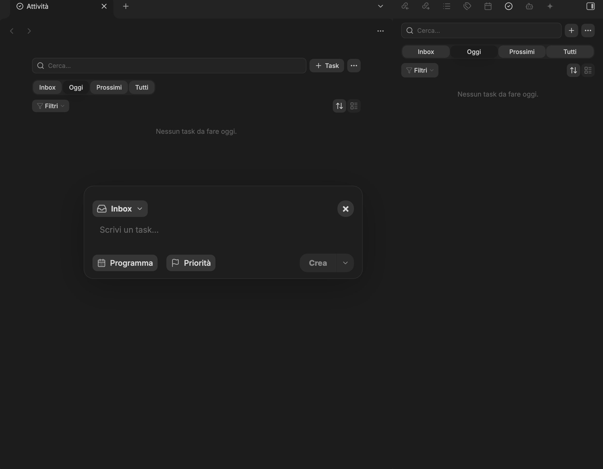
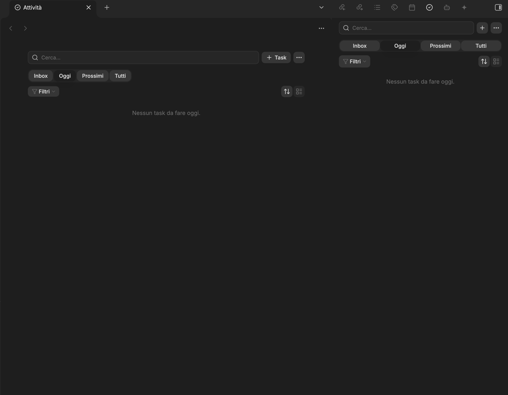
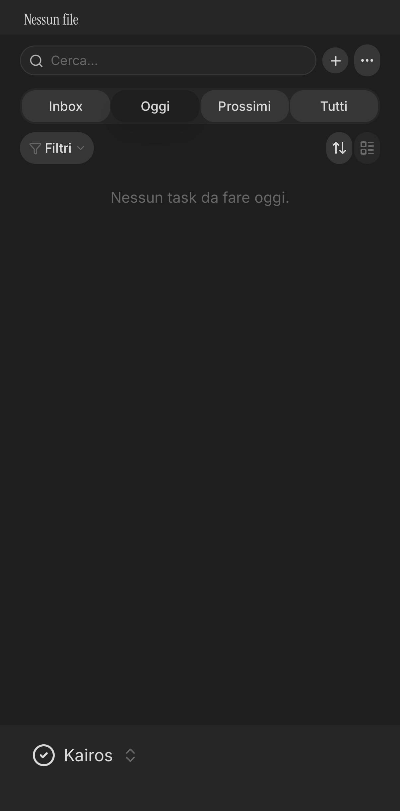
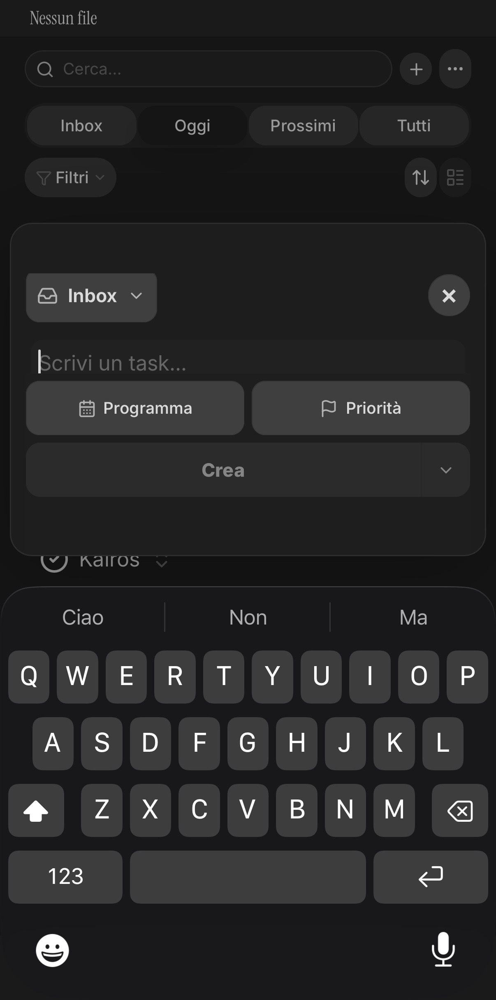

# Kairos

[](https://github.com/salvatoreierardisi-hub/kairos/releases/latest)
[](https://github.com/salvatoreierardisi-hub/kairos/actions/workflows/ci.yml)
[](LICENSE)

**A local-first task workspace for Obsidian. Keep tasks in your Markdown notes, then
manage them from one focused view.**

Kairos indexes ordinary Markdown checkboxes across your vault and brings them together
in a full-page workspace, a compact sidebar, and interactive daily-note projections.
There is no separate task database and no duplicated source of truth.



> [!NOTE]
> Kairos currently ships with an Italian user interface. The documentation is written
> in English so the project can be evaluated and contributed to internationally.

## Highlights

- **One task, one Markdown line.** Kairos reads and updates the original checkbox in
  place.
- **Four operational views.** Move between Inbox, Today, Upcoming, and All without
  moving the underlying task.
- **Fast capture.** Create globally in `_inbox/Inbox.md`, or create contextually in the
  current or selected project note.
- **Natural dates and Agenda.** Capture trailing Italian or English date phrases, then
  review work day by day within a configurable horizon.
- **Safe recurrence.** Complete supported daily, weekly, monthly, or yearly series in
  one guarded write, while richer rules fall back to the source note unchanged.
- **Unified editor.** Create with an explicit destination, then edit text, status, due
  date, and priority from the same interface.
- **Create and open.** Turn an Inbox task into a linked detail note, or open a project
  task at its source line immediately after creation.
- **Daily-note projection.** Due tasks can appear as an interactive block inside the
  matching daily note while remaining in their source file.
- **Powerful review tools.** Search, filter, sort, group, save views, select multiple
  tasks, and apply bulk actions.
- **Desktop and mobile.** Use the right sidebar for quick desktop access, expand to a
  full page when needed, and capture comfortably on mobile.
- **Tasks-compatible syntax.** Kairos understands the familiar priority and date emoji
  used by the Obsidian Tasks ecosystem, without requiring that plugin.

## Screenshots

<table>
  <tr>
    <td width="58%">
      
      <br><strong>Full page and right sidebar</strong>
    </td>
    <td width="42%">
      
      <br><strong>Mobile task panel</strong>
    </td>
  </tr>
  <tr>
    <td>
      
      <br><strong>Desktop task editor</strong>
    </td>
    <td>
      
      <br><strong>Mobile capture</strong>
    </td>
  </tr>
</table>

The screenshots use an empty demonstration vault and contain no personal note content.

## How it works

```text
Markdown notes ──▶ TaskIndex ──▶ Page / sidebar / daily projection
       ▲                                      │
       └──────────── TaskWriter ◀─────────────┘
```

`TaskIndex` watches Markdown files in the vault and keeps an in-memory projection of
their tasks. Every edit goes through `TaskWriter`, which validates the expected source
line before changing it. The Markdown file remains the only persistent source of truth.

Global capture always writes to the configured Inbox, even when a due date is assigned.
Contextual capture writes directly to a project note. Due dates control where a task is
shown; they do not silently relocate its source line.

## Task syntax

Kairos reads and writes standard Markdown checkboxes:

```markdown
- [ ] Renew car insurance ⏫ 📅 2026-07-20 #progetto/casa
```

| Marker | Meaning |
| --- | --- |
| `- [ ]` / `- [/]` / `- [x]` / `- [-]` | Open / in progress / completed / cancelled |
| `📅 YYYY-MM-DD` | Due date |
| `⏳ YYYY-MM-DD` | Scheduled date (used when no due date exists) |
| `✅ YYYY-MM-DD` | Completion date |
| `❌ YYYY-MM-DD` | Cancellation date |
| `🔁 every [N] day\|week\|month\|year [when done]` | Supported recurrence |
| `🔺` / `⏫` / `🔼` / `🔽` / `⏬` | Highest to lowest priority |
| `#tag` | Standard Markdown tag |

## Installation

### BRAT

1. Install the [BRAT](https://github.com/TfTHacker/obsidian42-brat) plugin in Obsidian.
2. Choose **Add Beta plugin**.
3. Enter `https://github.com/salvatoreierardisi-hub/kairos`.
4. Enable Kairos under **Settings → Community plugins**.

### Manual installation

1. Download `main.js`, `manifest.json`, and `styles.css` from the
   [latest release](https://github.com/salvatoreierardisi-hub/kairos/releases/latest).
2. Create `<vault>/.obsidian/plugins/kairos/`.
3. Copy the three files into that folder.
4. Reload Obsidian and enable Kairos under **Settings → Community plugins**.

Kairos requires Obsidian 1.5.0 or later and works on desktop and mobile.

## Quick start

- Click the Kairos ribbon icon on desktop to open the right sidebar.
- Run **Apri Kairos come pagina** from the Command Palette to open the full-page view.
- Run **Nuovo task in Inbox (Kairos)** for global capture.
- Run **Nuovo task nella nota corrente (Kairos)** to keep a task in its project context.
- Click a task to edit it. Use its context menu to open the source note, change status,
  reschedule, reprioritize, move, tag, or delete it.
- Use the menu next to **Crea** to choose **Crea e apri** when a task needs a linked
  detail note.

Settings let you configure the Inbox path, inherit Obsidian Daily Notes settings or use
a custom daily-note setup, define the Agenda horizon, exclude folders from indexing,
and define project and area tag prefixes.

## Plugin API

Other local plugins and automations can use the versioned API exposed at
`app.plugins.plugins.kairos.api`. Version 1 returns plain data objects and offers guarded
query, create, complete, status, reschedule, priority, move, delete, and navigation
operations. Every persistent mutation still passes through `TaskWriter`; callers must
refresh stale task references instead of bypassing conflict protection. The serializable
`api.descriptor` lists the available operations and the `file + line + source` task-ref
contract.

## Development

```bash
npm install
npm test
npx tsc --noEmit
npm run build
```

Domain logic lives in `src/core/` and is covered by Vitest. Obsidian integration lives
in `src/index/`, `src/io/`, `src/view/`, `src/settings/`, and `src/main.ts`.

See [Architecture](docs/architecture.md), [Contributing](CONTRIBUTING.md), and the
[Changelog](CHANGELOG.md).

## License

[MIT](LICENSE) © 2026 Salvo
